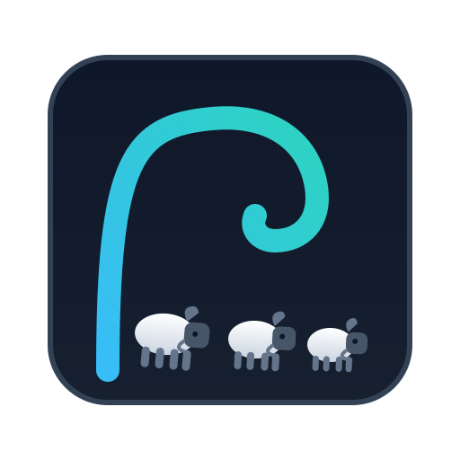
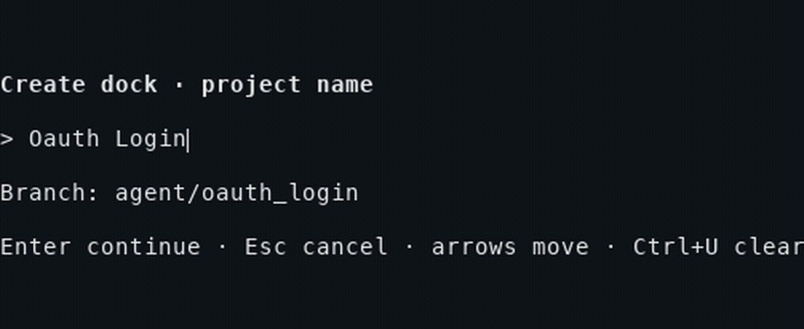
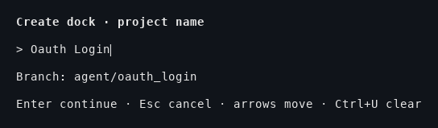
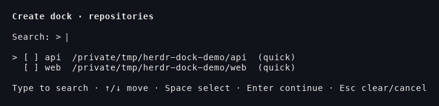
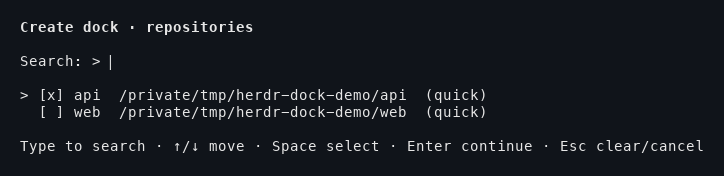
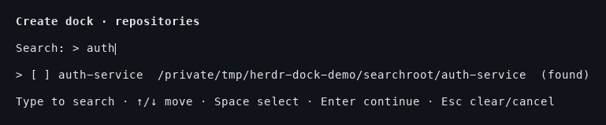
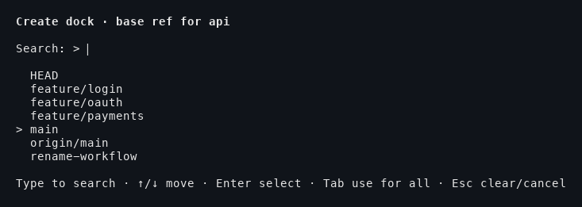
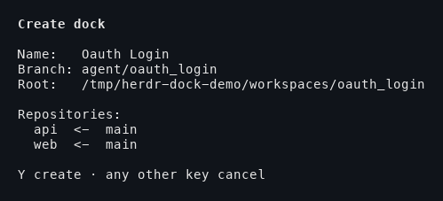
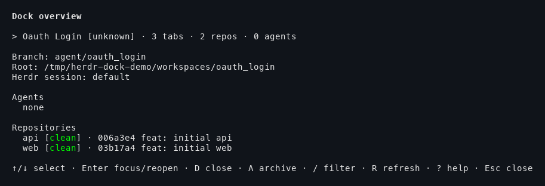

<div align="center">



# herdr-dock

**One coordinated workspace across many Git repositories — for Herdr.**

`herdr-dock` turns a set of related repositories into a single, resumable agent workspace: it creates sibling Git worktrees on a shared branch, writes shared agent guides, opens one Herdr tab per repository, and remembers everything so you can resume it later.

</div>

---

<p align="center">
  <a href="https://github.com/alexkarpandrus/herdr-dock/actions/workflows/ci.yml"></a>
  <a href="https://crates.io/"></a>
  <a href="LICENSE"></a>
  
  
  
</p>

---

## Demo

Watch the whole flow — name a project, pick repositories, choose a base ref, review, and create — in one pass.

<p align="center">
  
</p>

### Screenshots

**1. Name the project** — the branch slug is previewed as you type.

<p align="center"></p>

**2. Pick repositories** — a saved quick list stays on top; type to search configured roots.

<p align="center"></p>

<p align="center"></p>

**3. Discovery** — fuzzy search finds Git repositories under your configured roots and remembers them for next time.

<p align="center"></p>

**4. Choose a base ref** — branches and remote refs filter as you type; `Tab` applies one ref to every repository.

<p align="center"></p>

**5. Review and create** — confirm the branch, root, and per-repository plans; the worktrees and shared `AGENTS.md`/`CLAUDE.md` are written on commit.

<p align="center"></p>

**6. Dock overview** — live Herdr workspace and agent states, dirty counts, and latest commit subjects, with resize-aware color-coded statuses.

<p align="center"></p>

---

## What it does

The `herdr-dock.create` action opens a terminal popup that:

1. accepts a project name and previews its `<prefix>/<snake_case_slug>` branch;
2. selects one or more configured repositories;
3. loads or saves named repository presets with `P` and `S`;
4. selects and remembers a base ref for each repository (`Tab` uses one ref for all);
5. reviews the branch, root, and repositories, then creates them as sibling Git worktrees;
6. writes `AGENTS.md` and `CLAUDE.md` in their shared root; and
7. opens one Herdr tab per repository, plus a `shared` tab when multiple repositories are selected.

The `herdr-dock.overview` action shows saved dock history with live Herdr workspace and agent states, dirty repository counts, and latest commit subjects. Press Enter to focus an open dock or reopen a closed dock and resume its saved agent sessions. Press `D` to close a dock and mark it done. Press `A` to archive and remove clean worktrees.

The `herdr-dock.setup` action writes the recommended keybindings into your Herdr configuration.

---

## Why a dock?

Running one agent per service gets messy fast: each repo solves its half of a feature, the branches drift, and nobody has the full picture. A dock bundles the whole change together:

- **One shared branch** across every repository, so the work stays in lockstep.
- **Sibling worktrees**, so your main checkouts stay clean and yours to use.
- **A shared root** with `AGENTS.md`/`CLAUDE.md` describing the workspace to any agent that lands there.
- **One workspace, many tabs** — a tab per repository plus a `shared` tab for the cross-cutting view.
- **Resumable sessions** — close the dock and Herdr keeps the session IDs, so reopening gets back to work, not to square one.

---

## Persistence and lifecycle

Herdr Dock uses one JSON file at `$HERDR_PLUGIN_STATE_DIR/state.json`. It does not use a database. It writes through a temporary file and renames it atomically. It writes only when dock lifecycle data or resumable agent metadata changes.

A per-state-file lock permits only one Herdr Dock management action at a time. If another create or overview action is already open for the same state directory, the second action exits with a retry message. Running docks and agent sessions are not locked. Temporary state files include the writer process ID, so concurrent or interrupted writers do not share a temporary path.

Each dock record stores its Herdr session name, current workspace ID, tab labels and working directories, repositories, completion time, and the last observed recognized agents. Each agent record stores its tab, name, kind, working directory, and Herdr-provided resumable session ID or path:

```json
{
  "herdr_session": "default",
  "workspace_id": "w1",
  "completed_at_unix": 1740000000,
  "tabs": [{"label": "api", "cwd": "/work/dock/api"}],
  "agents": [{
    "name": "reviewer",
    "kind": "codex",
    "cwd": "/work/dock/api",
    "tab": 0,
    "session": {
      "source": "herdr:codex",
      "agent": "codex",
      "kind": "id",
      "value": "session-id"
    }
  }]
}
```

The overview refreshes this metadata from Herdr. Enter focuses a live workspace. If the workspace was closed, Enter recreates the dock tabs and resumes supported agent sessions in their saved working directories. If Herdr did not report a resumable session, the overview keeps the agent record and reports that it cannot resume that agent.

`D` asks for confirmation, snapshots the latest agent metadata, closes the selected workspace and all its tabs and processes, keeps the worktrees, and sets the dock status to `done`. It does not stop the named Herdr server because that could stop unrelated workspaces. Reopening clears the completion time and makes the dock active again.

`A` remains the destructive archive action. It refuses worktrees with tracked, untracked, or ignored files, rejects symbolic links and relocated worktrees, closes an open workspace, removes verified worktrees, and keeps the Git branches and archived history record.

---

## Install

### Quick start

```sh
# 1. Install — downloads the repository, builds with Cargo, or fetches a prebuilt binary
herdr plugin install alexkarpandrus/herdr-dock

# 2. Optional — add explicit repositories; the first run prompts for a search directory
${EDITOR:-vi} "$(herdr plugin config-dir herdr-dock)/config.toml"

# 3. Try it, then bind hotkeys (see below)
herdr plugin action invoke create --plugin herdr-dock
```

The first create run writes a `config.toml` template, then prompts for a directory to scan and records it as a `repository_search_roots` entry. You can also edit the file to add explicit `[[repositories]]` blocks or more search roots.

Requirements:

- macOS or Linux;
- [Herdr](https://herdr.dev) 0.8.2 or newer;
- Git; and
- Rust 1.89 and Cargo only to build from source; otherwise a prebuilt binary is fetched from GitHub Releases (macOS arm64/x86_64, Linux x86_64).

### Link a local checkout

Use this option when developing the plugin:

```sh
git clone https://github.com/alexkarpandrus/herdr-dock.git
cd herdr-dock
cargo build --release
herdr plugin link "$PWD" --enabled
```

The local link uses the existing binary. Run `cargo build --release` again after source changes.

---

## Configure repositories

Open the plugin configuration file:

```sh
${EDITOR:-vi} "$(herdr plugin config-dir herdr-dock)/config.toml"
```

```toml
branch_prefix = "agent"
# By default, worktrees live under HERDR_PLUGIN_STATE_DIR/workspaces.
# worktree_root = "~/worktrees"
# Plain Git is the default. Use Worktrunk for lifecycle hooks and setup.
# worktree_manager = "worktrunk"
# Type in the repository picker to search Git repositories under these roots.
repository_search_roots = ["~/Src"]

[[repositories]]
name = "api"
path = "~/src/api"

[[repositories]]
name = "web"
path = "~/src/web"
```

The optional `name` becomes the worktree directory and tab label. Repository names must be unique.

`repository_search_roots` enables fuzzy repository search directly in the repository picker. The saved quick list stays at the top. Start typing to filter it and show matching Git repositories from the configured roots below. Press Space to select a search result, then Enter to continue. Herdr Dock saves it in the quick list for next time.

The base-ref picker also filters branches and remote refs as you type.

`worktree_manager = "worktrunk"` requires [`wt`](https://worktrunk.dev/) on the plugin's `PATH`. Herdr Dock overrides Worktrunk's path for each command so worktrees stay under the shared dock root. Worktrunk hooks remain enabled and can ask for approval. Each dock saves its manager, so later configuration changes do not change how that dock is archived.

Run the create action after saving the configuration:

```sh
herdr plugin action invoke create --plugin herdr-dock
```

---

## Bind a hotkey

Add a plugin action binding to your Herdr user configuration:

```toml
[[keys.command]]
key = "prefix+d"
type = "plugin_action"
command = "herdr-dock.create"
description = "create dock"

[[keys.command]]
key = "prefix+o"
type = "plugin_action"
command = "herdr-dock.overview"
description = "show dock overview"
```

With Herdr's default `ctrl+b` prefix, press `ctrl+b`, then `d` to create a dock or `ctrl+b`, then `o` to open the overview. Herdr plugin v1 cannot register keybindings from a plugin manifest, so users must add these bindings to their Herdr configuration.

You can also add them automatically with:

```sh
herdr plugin action invoke setup --plugin herdr-dock
```

---

## Development

```sh
cargo test
HERDR_DOCK_TEST_WORKTRUNK=1 cargo test real_worktrunk_lifecycle_when_enabled -- --nocapture
cargo clippy --all-targets -- -D warnings
```

---

## License

MIT
